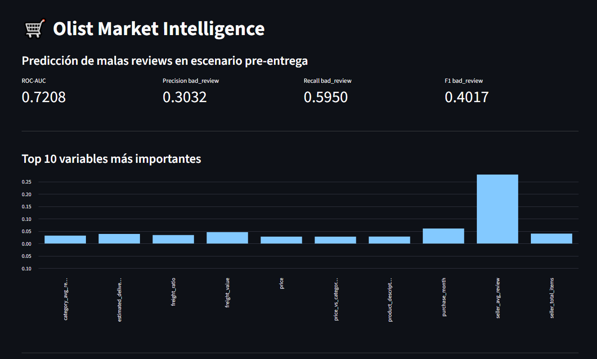
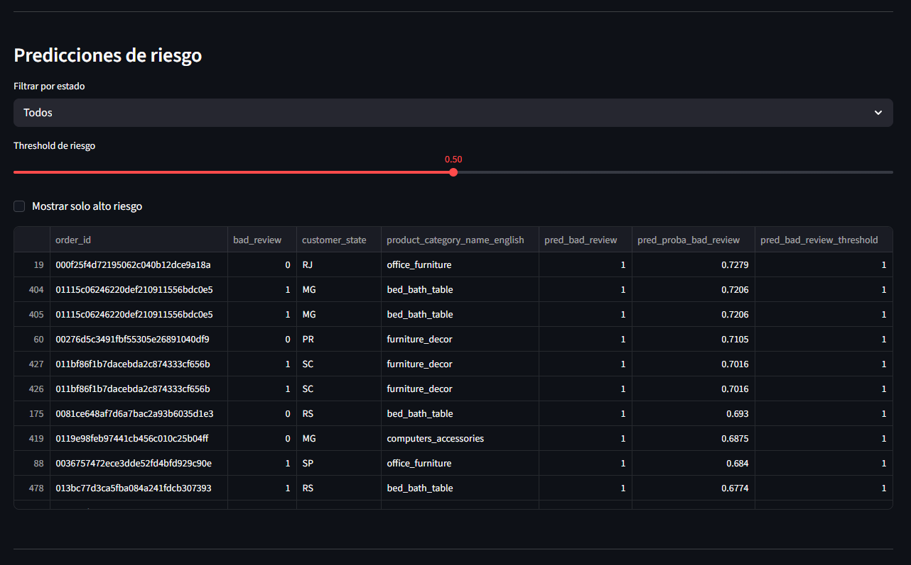
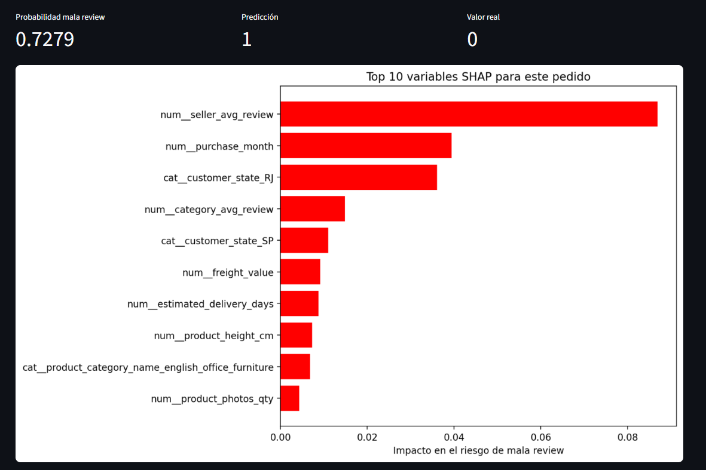

# 🛒 Olist Market Intelligence — Predicting Bad Customer Reviews

## 📌 Problem

In e-commerce marketplaces, negative customer experiences directly impact retention, seller reputation, and platform trust.

This project aims to **predict the probability of a bad customer review (score ≤ 2)** using transactional, product, and seller-level data from Olist.

  

---

## 🎯 Objectives

- Identify key drivers of poor customer experience
- Build predictive models for:
  - Post-delivery analysis (diagnostic)
  - Pre-delivery risk prediction (operational)
- Compare performance and business applicability

---

## 🗂️ Data

Dataset: Brazilian e-commerce public dataset (Olist)

Main tables:
- orders
- order_items
- products
- customers
- reviews
- geolocation

---

## ⚙️ Project Architecture

OLIST_MARKET_INTELLIGENCE/
* ├── app/
* ├── data/
* ├── images/
* ├── models/
* ├── notebooks/
* ├── reports/
* ├── sql/
* ├── src/
* ├── README.md
* └── requirements.txt

---

## 🧱 Data Mart

A unified table (`ml_order_reviews`) was built combining:

- order-level data
- product features
- seller aggregated statistics
- category-level benchmarks

---

## 🤖 Models

Two modeling approaches were developed:

### 1️⃣ Post-Delivery Model

Includes delivery outcome features:

- delivery_days
- is_late
- delay_vs_estimate_days

**Use case:**
- Root cause analysis
- Customer experience diagnostics

**Performance:**
- ROC-AUC: ~0.80
- Better predictive power

  

---

### 2️⃣ Pre-Delivery Model (No Leakage)

Excludes future information:

- No actual delivery outcome variables
- Only uses data available at purchase time

**Use case:**
- Early risk detection
- Operational prioritization

**Performance:**
- ROC-AUC: ~0.72
- Lower accuracy but more realistic

---

## 📊 Key Results

| Model                | ROC-AUC | Recall (bad reviews) | Precision |
|---------------------|--------|---------------------|----------|
| Post-delivery       | 0.80   | ~0.56               | ~0.48    |
| Pre-delivery        | 0.72   | ~0.59               | ~0.30    |

---

## 💡 Key Insights

- Delivery-related features are the strongest predictors of bad reviews
- Seller historical performance adds significant signal
- Price relative to category average helps explain expectations vs reality
- Freight cost ratio is associated with dissatisfaction
- Early prediction is possible, but involves a tradeoff between recall and precision

---

## 🔍 Model Explainability

SHAP was used to explain individual model predictions and identify which variables contributed most to the predicted risk of a negative review.

The dashboard allows users to select an individual order and analyze the direction and magnitude of each variable's contribution.

  

---

## ⚠️ Limitations

- No real-time data (batch dataset)
- No temporal validation split (future leakage risk across time)
- Limited feature engineering on text/reviews
- No hyperparameter tuning optimization
- No causal inference (correlation-based model)

---

## 🚀 Next Steps

- Add time-based validation (train on past, test on future)
- Introduce NLP features from review text
- Use Gradient Boosting models (LightGBM / XGBoost)
- Build real-time scoring pipeline
- Deploy the Streamlit dashboard to a public cloud environment

---

## 📈 Business Impact

This solution can help:

- Identify high-risk orders before delivery
- Prioritize customer support interventions
- Monitor seller quality
- Improve logistics decision-making
- Reduce negative customer experiences

---

## 🛠️ Tech Stack
- Python
- DuckDB
- Pandas
- Scikit-learn
- Random Forest
- Streamlit
- SHAP
- Joblib
- Git / GitHub

---